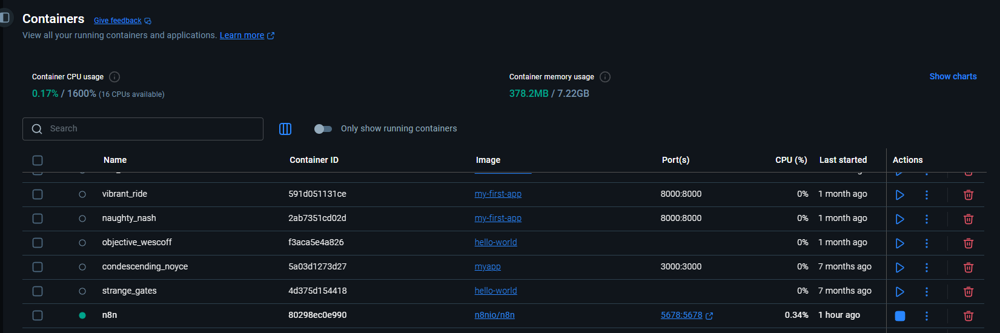
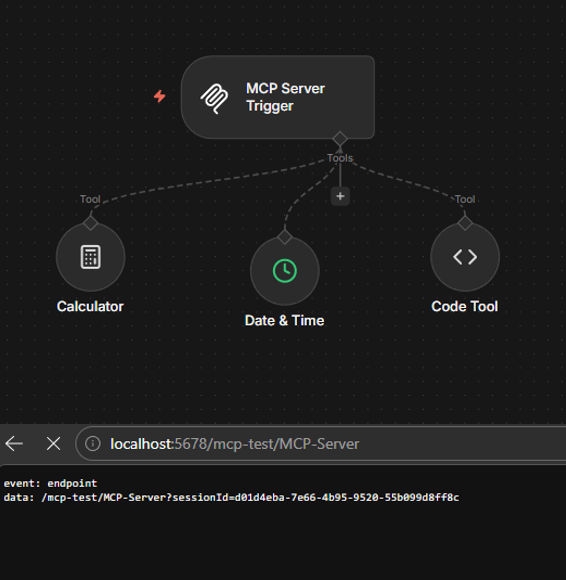

# A7: MCP-Server, AI Agent, and External Tool Integration

## Task 1: MCP Infrastructure & Server Setup

1. Docker Set Up

This is the running of n8n docker and by using  ngrok tunnel the Production URL is accessible from the internet.

2.  MCP Server Workflow

This screenshot (MCP Server Workflow.png) shows the MCP Server workflow configured in n8n. 
The workflow is built around an MCP Server Trigger node, which acts as the central hub exposing three internal tools to any connected MCP Client. 
The three tools are: a Calculator node for performing mathematical computations, a Date & Time node for retrieving current date and time information, and a Code Tool (Text Formatter) for processing and transforming text. 
The browser address bar at the bottom shows the MCP Server is active and accessible at the test endpoint localhost:5678/mcp-test/MCP-Server, with the server returning an SSE (Server-Sent Events) endpoint response, confirming the server is live and the tools are discoverable by any connected AI Agent.

3. AI Agent Client
![image]AI Agent Client.png)
This screenshot (AI Agent Client.png) shows both the AI Agent Client workflow (left) and the MCP Server Workflow (right) open side by side, replicating the example configuration shown in the assignment.
The AI Agent Client workflow on the left consists of a "When chat message received" trigger connected to an AI Agent node, which is powered by three sub-components: the Groq Chat Model (llama-3.3-70b-versatile) as the language model, Simple Memory for maintaining conversation context across multiple turns, and an MCP Client that connects to the MCP Server's Production URL.
The chat panel at the bottom left shows a test conversation where the user asked "What time is it right now?" and the agent successfully responded with the current time by calling the Date & Time tool through the MCP Client.
The MCP Server workflow on the right displays the three registered tools: Calculator, Date & Time, and Code Tool.

## Task 2: Telegram & Google Calendar Integration

1. Automated Project Scheduling (Telegram Bot API + Google Calendar Tool)
![image]Automated Project Scheduling (Conversation in Telegram+Successful Workflow).png)
This screenshot (Automated Project Scheduling (Conversation in Telegram+Successful Workflow).png) demonstrates the successful integration between Telegram and the n8n AI Agent workflow.
On the left side, the Telegram conversation shows the user sending a command to the bot requesting the creation of a project schedule with 4 phases in Google Calendar.
The bot successfully responded with "All 4 events have been created in your Google Calendar," confirming the agent processed the natural language request correctly.
On the right side, the n8n execution log shows the workflow ran successfully in 5.84 seconds (ID#16). The workflow consists of a Telegram Trigger that receives incoming messages, an AI Agent that processes the request using the Groq Chat Model (llama-3.3-70b-versatile) and Simple Memory for context, an MCP Client for tool access, and a Google Calendar node that created 4 events.
The final Telegram node sent the confirmation message back to the user.

2. Automated Project Scheduling (Google Calendar Records)
![image]Automated Project Scheduling (Calendar Record).png)
This screenshot (Automated Project Scheduling (Calendar Record).png) shows the Google Calendar view for April 2026, confirming that all four project phase events were successfully created by the AI Agent.
The events appear on their respective scheduled dates: April 1 — 1st Phase: Literature Review, April 8 — 2nd Phase: Project Proposal, April 15 — 3rd Phase: Update Progress, and April 22 — 4th Phase: Final Presentation.
Each date also shows a duplicate event labeled {{ $fromAI('summary', 'The tit... which was created during an earlier test run before the tool parameters were fully configured.
The four correctly named events confirm that the AI Agent successfully interpreted the natural language scheduling command received via Telegram and used the Google Calendar tool to create all required project milestone events on the appropriate dates.
